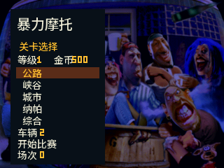
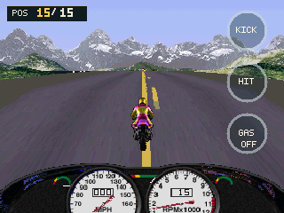
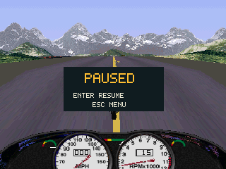

# 暴力摩托 · BBK 9588 移植版

3DO 版《Road Rash》在步步高 9588 上的预览移植。

## 截图

以下四张均从当前 `RoadRash.bda` 与修正后的 `Rash.pak` 在 BBK 9588 模拟器 v0.1.5 中实际截取，尺寸为 320×240。采集方式和校验和见 [截图来源](screenshots/README.md)。

主菜单：


关卡与摩托车选择：



赛道驾驶：



比赛暂停：



## 快速开始

1. 从 [Releases](https://github.com/HelloClyde/BBK9588-RoadRash/releases) 下载 `RoadRash.bda`，按 9588 的常规 BDA 安装方式安装。
2. 从自己合法持有的欧版 3DO 游戏资源生成单文件包：`python tools/build_resource_pack.py --source <原版Rash目录>`。当前已验证资源包的 SHA-256 为 `946a4c2fe693b9011f3de04ec95a07b8dc368fa44d5a4cc1f8ea9cfe61ad2957`，包含标题背景、五条赛道、车辆与对象素材、音效和一首音乐，不含视频。
3. 把 `Rash.pak` 复制到 `B:\应用\数据\游戏\Rash\Rash.pak`；没有 B: 盘时用 `A:\应用\数据\游戏\Rash\Rash.pak`。只复制这一份资源文件，不要放到盘根目录。已有原版资源的开发者也可运行 `python tools/package_game.py --source <原版Rash目录>`，在本机生成包含 BDA 和资源包的 ZIP。原版游戏资源不随公开仓库或 Release 分发。

横握时，中文菜单用实体左/右键选择，确认键进入；选关页用左/右键选赛道、上/下键换摩托车。比赛中实体上/下键转向，屏幕 GAS 切换油门、HIT 甩鞭、KICK 踢腿；确认键刹车，返回键暂停。设置页可关闭音乐而保留音效。

若标题背景变成黑底，或赛道只有色块而没有摩托车与路面纹理，先核对资源包路径和 SHA-256。诊断日志位于资源目录的 `RRDEBUG.LOG`，创建失败时尝试 `A:\RRDEBUG.LOG`；其中 `PACK_OPEN`、`MENU_ASSET_DONE`、`BIKE_FRAMES_DONE` 和 `ROAD_TEX_DONE` 应显示资源已加载。旧版打包脚本把 `rashOpt.rsrc` 放在包尾，在模拟器中会导致后两项加载失败；请重新生成 `Rash.pak`。

## 项目介绍（开发者）

一个 `RoadRash.bda` 提供中文菜单、五条赛道、对手与车辆、碰撞、存档和声音。C 游戏源码在 [`src/`](src/)，主机测试在 [`tests/`](tests/)，资源处理脚本在 [`tools/`](tools/)；根目录保留构建和测试入口。移植仍采用部分适配渲染、物理和 AI，尚不是原版逐帧复刻；当前标签 BDA 尚需 9588 实机复测。

在 Windows PowerShell 中构建与验证：

```powershell
git clone --recurse-submodules https://github.com/HelloClyde/BBK9588-RoadRash.git
cd BBK9588-RoadRash
pwsh ./sdk/scripts/setup_toolchain.ps1
python build.py
python test_host.py
```

`build.py` 从固定提交下载四个上游赛道遍历文件，逐一校验 SHA-256 后放入忽略的 `local-data/`。它不会下载游戏镜像。已有工具链可通过 `python build.py --prefix <工具链安装目录>` 指定。中文字形固定在 `src/road_ui_font.h`；需重生时安装 Pillow 和 Noto Sans SC 可变字体，运行 `python tools/generate_ui_font.py --font <字体文件路径>`。

## 第三方依赖与开源协议

- 运行目标：BBK 9588、BDA 程序及用户自备的 3DO 游戏资源。
- 构建依赖：Python 3、Git、Windows PowerShell、[bbk9588-bda-sdk](https://github.com/HelloClyde/bbk9588-bda-sdk) 子模块（固定提交 `870470ce09a5b33ae9b2d0c1b8e40c0435751a98`）及其 MIPS GCC 15.2.0 工具链。主机测试需要本机 GCC。
- 上游赛道遍历文件来自 [3DO Road Rash 逆向重建项目](https://github.com/trapexit/3do-decomp-road-rash)，固定提交 `97af68f3aabd71b173d8e5b8fed1e03ef106100d`。感谢该项目；上游未提供明确的再分发许可证。
- 自编移植代码按 [MIT](LICENSE) 授权。SDK、上游代码、Noto 字形、原版图标、截图与游戏资源不由此 MIT 许可证覆盖；来源和具体权利状态见 [THIRD_PARTY.md](THIRD_PARTY.md)。
