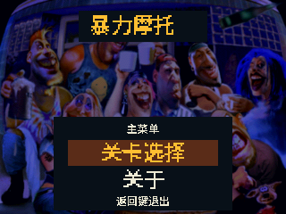
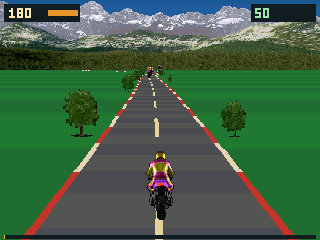

# 暴力摩托 · BBK 9588 移植版

面向步步高 9588 的《Road Rash》3DO 版移植。一个 `RoadRash.bda` 提供中文菜单、五条赛道、对手与车辆、碰撞、存档和声音；运行时读取用户自行准备的 3DO 游戏资源。当前为预览版，画面和物理仍有适配实现，不能视为原版的逐帧复刻。

## 快速开始

从 [Releases](https://github.com/HelloClyde/BBK9588-RoadRash/releases) 下载 `RoadRash.bda`，按 9588 的 BDA 安装方式安装。游戏数据不随公开版本分发：从自己持有的 3DO 游戏资源生成 `Rash.pak`，放在 `B:\应用\数据\游戏\Rash\Rash.pak`；没有 B: 盘时放在 `A:\应用\数据\游戏\Rash\Rash.pak`。旧版散装文件也可读取。无资源包无法进入赛道。

横握时，在中文菜单用实体左/右键选择，确认键进入；关卡页用左/右键选赛道、上/下键换摩托车。比赛中实体上/下键转向，屏幕上的 GAS 切换油门、HIT 甩鞭、KICK 踢腿；实体方向键与 HIT 的组合操作保留。确认键刹车，返回键暂停。设置中可关闭音乐，音效仍会播放。游戏诊断日志写在资源目录下的 `RRDEBUG.LOG`。

开发者在 Windows PowerShell 中构建：

```powershell
git clone --recurse-submodules https://github.com/HelloClyde/BBK9588-RoadRash.git
cd BBK9588-RoadRash
pwsh ./sdk/scripts/setup_toolchain.ps1
python build.py
python test_host.py
```

`build.py` 自动下载固定版本的 [3DO 逆向重建项目](https://github.com/trapexit/3do-decomp-road-rash)到忽略的 `local-data/`，仅取四个赛道遍历源文件参与本机构建。它不会下载游戏镜像或资源。已有工具链可通过 `python build.py --prefix <工具链安装目录>` 指定。资源包脚本读取 `local-data/3do-eu-extracted/Rash/` 下合法取得的原版资源：`python build_resource_pack.py`；本地整包可再运行 `python package_game.py`。公开 CI 和 Release 只构建 BDA，不上传 `Rash.pak`。

中文字形已随源码固定为 `road_ui_font.h`。需要重新生成字形时，安装 Pillow 和 Noto Sans SC 可变字体，再运行 `python generate_ui_font.py --font <字体文件路径>`。

## 截图

以下为项目早期版本在模拟器中的实际截图。它们展示移植画面，菜单细节与当前版本可能不同；当前发布版仍需 9588 实机复测。





## 依赖与验证

- 运行：BBK 9588、`RoadRash.bda` 和用户自行准备的 3DO 游戏资源包。
- 构建：Python 3、Git、Windows PowerShell、[bbk9588-bda-sdk](https://github.com/HelloClyde/bbk9588-bda-sdk) 子模块，固定提交 `870470ce09a5b33ae9b2d0c1b8e40c0435751a98`；SDK 安装脚本提供 MIPS GCC 15.2.0。主机测试另需本机 GCC。
- 上游赛道遍历代码固定在 `97af68f3aabd71b173d8e5b8fed1e03ef106100d`，仅在构建时获取。详见 [第三方来源](THIRD_PARTY.md)。
- CI 执行无资源主机测试、BDA 构建和格式校验。此前版本有模拟器画面和 9588 真机反馈；公开标签构建的确切 BDA 尚无实机验收记录。CI 通过不代表实机无故障。

## 感谢与许可

移植作者：HelloClyde。赞助：唔识游水的鱼??。步步高电子词典游戏群（830340878）。感谢 [3DO Road Rash 逆向重建项目](https://github.com/trapexit/3do-decomp-road-rash)、BBK SDK 贡献者以及提供测试反馈的玩家。

本仓库自编移植代码按 [MIT](LICENSE) 授权。SDK、构建时获取的上游代码、字体、原版图标及游戏资源各自遵循其权利状态；本仓库的 MIT 许可不覆盖它们。具体来源与未明确的授权见 [THIRD_PARTY.md](THIRD_PARTY.md)。
